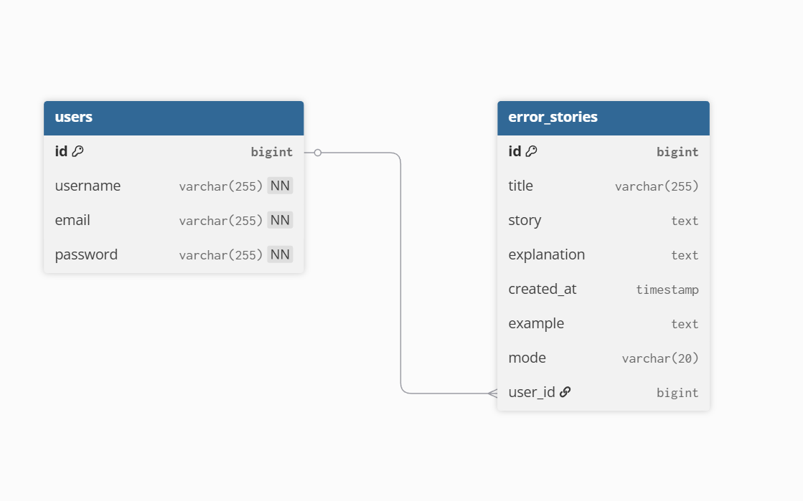

Backend Structure:

com.example.errorstory
│
├── ai
│   ├── GeminiService
│   ├── InternetChecker
│
├── engine
│   ├── ErrorParser
│   ├── ParsedError
│   ├── OfflineStoryEngine
│   ├── OfflineResult
│
├── model
│   ├── ErrorStory
│   ├── User
│
├── repository
│   ├── ErrorStoryRepository
│   ├── UserRepository
│
├── controller
│   ├── AuthController
│   ├── StoryController
│
├── service
│   ├── StoryService
│   ├── UserService
│
├── security
│   ├── JwtFilter
│   ├── JwtUtil
│
├── config
│   ├── CorsConfig
│   ├── SecurityConfig

Frontend Structure:
frontend
│
├── src
│   │
│   ├── api
│   │   └── api.js
│   │
│   ├── assets
│   │   └── react.svg
│   │
│   ├── components
│   │   ├── Navbar.jsx
│   │   └── StoryViewer.jsx
│   │
│   ├── pages
│   │   ├── Dashboard.jsx
│   │   ├── Library.jsx
│   │   ├── Login.jsx
│   │   └── Register.jsx
│   │
│   ├── App.css
│   ├── App.jsx
│   ├── index.css
│   └── main.jsx
│
├── public
│   └── index.html
│
├── node_modules
│
└── .gitignore

ER Diagram:
