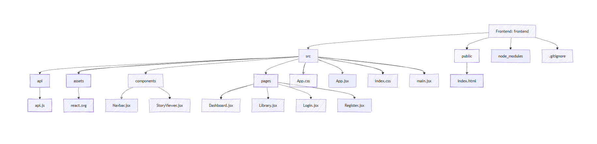

# 🧠 Error Story Generator

Error Story Generator is a full-stack web application that transforms boring programming errors into funny, educational stories.  
It supports both **AI-powered generation (Gemini API)** and a **smart offline engine**, making it usable even without internet.

Users can:
- Generate stories from programming errors
- Choose difficulty levels (FUNNY, INTERMEDIATE, ADVANCED)
- Switch between **AI mode** and **Default (Offline) mode**
- Save stories to their personal library
- Edit and delete saved stories
- View fixes and example code for each error
- Authenticate securely using JWT

---

## 🚀 Features

- 🤖 AI Mode using Google Gemini API
- 🧠 Offline Mode with custom error logic
- 🔐 JWT Authentication
- 📚 Personal Bug Library
- ✏️ Edit & Delete saved stories
- 🛠 Fix explanation section
- 💻 Example code generation
- 🌙 Dark UI theme

---

## 🏗 Tech Stack

### Frontend
- React.js
- Fetch API
- CSS (Custom UI)

### Backend
- Spring Boot
- Spring Security + JWT
- MySQL
- JPA / Hibernate
- Google Gemini API

---

## 📁 Project Structure





---


ER Diagram:


---

## 🔑 Authentication Flow

1. User registers / logs in
2. Server returns JWT token
3. Token stored in `localStorage`
4. Token sent with every API request using:


---

## 🔗 API Endpoints

| Method | Endpoint                     | Description                |
|-------|------------------------------|----------------------------|
| POST  | /api/auth/register           | Register user              |
| POST  | /api/auth/login              | Login user                 |
| POST  | /api/story/generate/{userId} | Generate & save story      |
| GET   | /api/story/history/{userId}  | Get all saved stories      |
| PUT   | /api/story/update/{id}       | Update story               |
| DELETE| /api/story/delete/{id}       | Delete story               |

---

## 🗄 Database Tables

### users
| Field | Type |
|------|------|
| id | bigint (PK) |
| username | varchar (unique) |
| email | varchar (unique) |
| password | varchar |

### error_stories
| Field | Type |
|------|------|
| id | bigint (PK) |
| title | varchar |
| story | text |
| explanation | text |
| example | text |
| mode | varchar |
| user_id | bigint (FK) |
| created_at | timestamp |

---

## 🛠 Setup Instructions

### Backend
1. Configure MySQL in `application.properties`
2. Add Gemini API key
3. Run Spring Boot application

### Frontend
```bash
cd frontend
npm install
npm run dev


